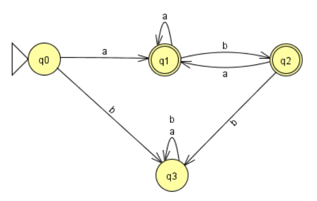

# Práctica 4: Simulación de un autómata finito determinista.

> Semana 6 al 12 de octubre de 2014

## Objetivo

Esta práctica consistirá en la realización de un programa escrito en C++ que lea un fichero las especificaciones de un autómata finito determinista (DFA) y, a continuación, simule el comportamiento del autómata para una cadena que se dé como entrada

## Fichero para la definición del autómata finito determinista

El autómata finito determinista vendrá definido en un fichero de texto con extensión `.dfa` y que tendrá el siguiente formato:

- Línea 1: Número total de estados del DFA
- Línea 2: Estado de arranque del DFA
- A continuación vendrá una línea para cada uno de los estados. Cada línea contendrá los siguientes números, separados entre sí por espacios en blanco:
  - Número identificador del estado. Los estados del autómata se representarán mediante números enteros sin signo. La numeración de los estados corresponderá a los primeros números naturales comenzando por el 0.
  - Un 1 si se trata de un estado de aceptación y un 0 si se trata de un estado de no aceptación.
  - Número de transiciones que posee el estado.
  - A continuación para cada una de las transiciones, y separados por espacios en blanco, se detallará la información siguiente:
    - Símbolo de entrada necesario para que se produzca la transición.
    - Estado destino de la transición

A modo de ejemplo, el autómata que se muestra en la Figura 1 tendría la definición especificada en el fichero `ejemplo.dfa`. El contenido de este fichero se muestra en la Figura 2.



```
4
0
0 0 2 a 1 b 3
1 1 2 a 1 b 2
2 1 2 a 1 b 3
3 0 2 a 3 b 3
```

El programa deberá detectar que no haya ningún error en la definición del autómata. Esto es, habría que analizar que se cumplen las siguientes condiciones:

- Existe solo un estado inicial para el autómata
- Para cada estado del autómata siempre existe un y solo una transición para cada uno de los símbolos del alfabeto

## Funcionamiento general del programa

El programa principal debería ofrecer al usuario las siguientes opciones:

- **Leer DFA**: al seleccionar esta opción se deberá solicitar al usuario que introduzca el nombre del fichero `.dfa` donde se encuentra la especificación del autómata. A continuación, se deberá crear el autómata a partir de la especificación dada en el fichero. Habrá que notificar al usuario si se produce algún error en la creación del DFA.
- **Mostrar el DFA**: al seleccionar esta opción se mostrará por pantalla el DFA actualmente definido (previamente leído de fichero) en nuestro programa. Para mostrar el DFA por pantalla se seguirá el formato establecidos para los ficheros `.dfa`
- **Analizar cadena**: al seleccionar esta opción se deberá solicitar al usuario que introduzca una cadena. Para la cadena indicada por el usuario se deberá determinar si es aceptada o no por el autómata actualmente definido. Al igual que ocurre con las dos opciones anteriores, esta opción tampoco se podrá ejecutar hasta que se haya definido un DFA.

  El formato de la traza a mostrar por pantalla será el siguiente:

  ```
  Cadena de entrada: ___________
  Estado actual     Entrada     Siguiente Estado

  X                 Y           Z
  X                 Y           Z
  X                 Y           Z

  Cadena de entrada ACEPTADA/NO ACEPTADA
  ```

  Tal y como se indica en las líneas anteriores, en primer lugar se deberá mostrar la cadena de entrada. A continuación se indicará cómo va transitando de un estado a otro el autómata según va leyendo la cadena de entrada y finalmente, se deberá mostrar el mensaje "Cadena de entrada ACEPTADA" si la cadena de entrada es aceptada por el DFA o el mensaje "Cadena de entrada NO ACEPTADA" si la cadena de entrada no es aceptada por el DFA.

  Para el DFA definido en la _Figura 2_ y para la cadena de entrada `w = abaab` se debería mostrar por la pantalla la traza siguiente:

  ```
  Input string: abaab
  Current State  Input  Next State
  0              a      1
  1              b      2
  2              a      1
  1              a      1
  1              b      2
  Input is ACCEPTED
  ```

## Detalles de implementación

Para la implementación de esta práctica se deberá definir una clase DFA que proporcione al menos los métodos necesarios para leer e inicializar un DFA desde un fichero, para mostrar un DFA, para identificar los estados de muerte del DFA y para realizar una traza de las transiciones llevadas a cabo cuando se da como entrada una determinada cadena.
